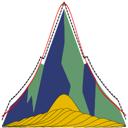

# SulfurKPeaks

Desktop application for fitting and analyzing Sulfur K-edge (S 1s) X-ray Absorption Spectroscopy (XANES) data using the Gaussian Curve Fitting (GCF) method.



## Download

**Windows:** Download the latest `SulfurKPeaks.exe` from the [Releases](../../releases) page. No installation required -- just run the executable.

**From source:** See [Running from Source](#running-from-source) below.

## Features

- **Peak Fitting** -- Decompose S K-edge XANES spectra into 6 Gaussian peaks (Exocyclic S, Heterocyclic S, Sulfoxide, Sulfone, Sulfonate, Sulfate) on a double arctangent baseline
- **Cross-section correction** -- Automatic scaling factor correction using the generic calibration curve from Manceau & Nagy (2012), with support for custom calibration curves
- **Convergence-optimized constraints** -- Peak centers, FWHM groups, and arctangent positions constrained per the published method to ensure physically realistic decompositions
- **Multi-sample comparison** -- Batch fitting, statistics, stacked bar charts, ratio heatmaps, and spectral overlays
- **Flexible peak control** -- Enable/disable individual peaks for fitting (F) and quantification (Q), adjust FWHM mode (single or two-group), and customize peak center positions and ranges
- **Manual baseline** -- Lock and manually adjust baseline parameters with optional height/width covariance
- **File format support** -- Load `.csv`, `.xmu`, `.xdi`, `.nor` spectra, and extract from Athena `.prj` project files
- **Session management** -- Save and restore complete fitting sessions (all samples, parameters, and settings)
- **Export** -- Publication-quality PDF/PNG plots, CSV data tables, and batch export

## Method

The fitting model follows the convergence-optimized GCF procedure from:

> Manceau A. & Nagy K.L. (2012) "Quantitative analysis of sulfur functional groups in natural organic matter by XANES spectroscopy." *Geochimica et Cosmochimica Acta* 99, 206-223. [doi:10.1016/j.gca.2012.09.033](https://doi.org/10.1016/j.gca.2012.09.033)

See [GCF_METHOD.md](GCF_METHOD.md) for detailed documentation of the model, constraints, scaling factor calibration, limitations, and references.

### Key constraints

| Parameter | Constraint |
|-----------|-----------|
| Peak centers 3-6 | Fixed at nominal energies |
| Peak center 1 (Exocyclic) | Shifts up to -0.2 eV |
| Peak center 2 (Heterocyclic) | Shifts up to +0.3 eV |
| Gaussian FWHM | Covaried in 1 or 2 groups (reduced vs. oxidized) |
| Arctangent 1 position | Between heterocyclic and sulfoxide |
| Arctangent 2 position | Above sulfate (or between sulfonate/sulfate) |
| Arctangent widths | Covaried (constrained equal) |
| Cross-section correction | Generic calibration curve (default) |

## Running from Source

### Requirements

- Python 3.10+
- numpy, scipy, pandas, matplotlib, seaborn, lmfit, Pillow, scikit-learn

### Install dependencies

```bash
pip install numpy scipy pandas matplotlib seaborn lmfit Pillow scikit-learn
```

### Run

```bash
# Launch the GUI
python s1s_peak_viewer_gui_final.py

# Optionally specify a directory of spectra to load
python s1s_peak_viewer_gui_final.py --spectra_dir /path/to/csv/files

# Command-line fitting of a single spectrum
python s1s_fitter_optimized.py spectrum.csv --plot

# Extract spectra from an Athena .prj file
python extract_athena_spectra.py file.prj --output spectra/
```

### Build executable

```bash
python build.py
# Output: dist/SulfurKPeaks.exe
```

## Input File Formats

| Format | Description |
|--------|-------------|
| `.csv` | Two columns: `energy,normalized_mu` (or any two-column CSV) |
| `.xmu` | Athena export format (comment lines starting with `#`) |
| `.nor` | Normalized Athena export |
| `.xdi` | XAS Data Interchange format |
| `.prj` | Athena project files (use `extract_athena_spectra.py` to extract) |

## License

MIT License. See [LICENSE](LICENSE) for details.

## Citation

If you use SulfurKPeaks in your research, please cite the underlying method:

```bibtex
@article{manceau2012,
  title={Quantitative analysis of sulfur functional groups in natural organic matter by XANES spectroscopy},
  author={Manceau, Alain and Nagy, Kathryn L.},
  journal={Geochimica et Cosmochimica Acta},
  volume={99},
  pages={206--223},
  year={2012},
  doi={10.1016/j.gca.2012.09.033}
}
```
